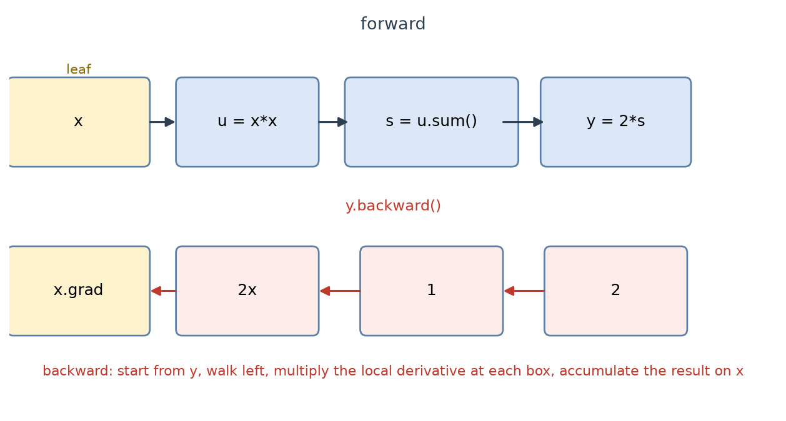

# B04 微积分与自动微分

对应原文：v1 2.3“自动求梯度”、v1 附录“数学基础·微分”；v2 2.4“微积分”、2.5“自动微分”。

文中所有 PyTorch 行为与报错文本都在 torch 2.14.0 上实测（本机 CPU 与远程 4070S 的版本一致），MXNet 侧结论来自 MXNet 源码与两版原文的相互印证。

## 与书对应

| 讲义小节 | 纸质书（第一版） | 电子版（第二版） |
|---|---|---|
| 1 导数、偏导数、梯度、链式法则 | 附录《数学基础》，"导数和微分"到"梯度" | [2.4 微积分](https://zh.d2l.ai/chapter_preliminaries/calculus.html) |
| 2 手工推导 | 附录"梯度"一节的例子 | 2.4 的例题 |
| 3 计算图与反向模式自动微分 | 无，本节补充 | [2.5 自动微分](https://zh.d2l.ai/chapter_preliminaries/autograd.html) 的第一节 |
| 4 读 MXNet 代码时要留意的差异 | 2.3 节的全部代码 | 2.5 |
| 5 实现一定会踩的坑 | 无，本节补充 | 2.5.2 到 2.5.4 |
| 6 自测题 | 无 | 无 |

纸质书那两章只有公式没有代码；电子版两节有代码，但用的是 `d2l` 包的封装（`d2l.plt`、
`d2l.use_svg_display`、`numerical_lim`），那些封装按仓库的解锁规则现在还不能用，
讲义里用等价的裸 torch 与 matplotlib 写法代替。

## 0 这一单元解决什么问题

训练模型就是找一组参数 $\boldsymbol{\theta}$，让损失 $L(\boldsymbol{\theta})$ 尽量小。损失是复合函数，从输入到输出要经过矩阵乘法、softmax、对数、求和。想知道“把 $w_{ij}$ 调大一点，损失变多少”，就要对复合函数求导。

手工求导在两层模型上还能做，到了几十层不现实，写错一个符号程序照样跑，只是不收敛。框架把链式法则机械化：前向计算时记下每一步运算构成计算图，反向时从标量损失出发逐步回代，这套机制叫自动微分。本单元练两种能力，一种看懂公式，知道 $\nabla_{\mathbf{x}}\mathbf{x}^\top\mathbf{x}=2\mathbf{x}$ 这类结果怎么来的；一种会用工具，知道 `.grad` 什么时候是 `None`、为什么反传前要清零。

v1 附录《数学基础》的微分部分还有"泰勒展开"与"海森矩阵"两节，d2l 主线用不到：
前者是优化算法收敛性分析的背景，后者是二阶方法的基础，而这本书里的优化器全是一阶的
（B25 讲的动量、Adam 都只在一阶梯度的基础上做文章）。这里记一笔，需要时回去翻附录。

## 1 导数、偏导数、梯度、链式法则

### 1.1 导数

标量函数 $f:\mathbb{R}\to\mathbb{R}$ 在 $x$ 处的导数为

$$f'(x)=\lim_{h\to 0}\frac{f(x+h)-f(x)}{h}.$$

几何含义是曲线在 $x$ 处切线的斜率。等价记号有 $f'(x)=y'=\frac{dy}{dx}=Df(x)$。常用法则：$DC=0$，$Dx^n=nx^{n-1}$，$De^x=e^x$，$D\ln x=1/x$；常数相乘、加法、乘法、除法法则分别为

$$\frac{d}{dx}[Cf]=C\frac{df}{dx},\quad \frac{d}{dx}[f+g]=\frac{df}{dx}+\frac{dg}{dx},\quad \frac{d}{dx}[fg]=f\frac{dg}{dx}+g\frac{df}{dx},\quad \frac{d}{dx}\frac{f}{g}=\frac{gf'-fg'}{g^2}.$$

原文用差商 $\frac{f(1+h)-f(1)}{h}$ 逼近 $f(x)=3x^2-4x$ 在 $x=1$ 处的导数，$h$ 取 $10^{-1}$ 到 $10^{-5}$ 时结果依次为 2.30000、2.03000、2.00300、2.00030、2.00003，收敛到解析值 $6\times 1-4=2$。同样的计算换成 float32，$h=10^{-5}$ 给出 2.00272，误差比 $h=10^{-4}$ 的 2.00033 还大：$h$ 大时截断误差大，$h$ 太小时 $f(x+h)-f(x)$ 是相近数相减，有效位被吃掉，舍入误差再被 $h$ 除而放大。5.6 节的梯度检验建立在这个权衡上。

### 1.2 偏导数与梯度

$y=f(x_1,\dots,x_n)$ 对第 $i$ 个变量的偏导数，把其余变量当常数：

$$\frac{\partial y}{\partial x_i}=\lim_{h\to 0}\frac{f(x_1,\dots,x_i+h,\dots,x_n)-f(x_1,\dots,x_i,\dots,x_n)}{h}.$$

全部偏导排成列向量就是梯度 $\nabla_{\mathbf{x}}f(\mathbf{x})=\left[\frac{\partial f}{\partial x_1},\dots,\frac{\partial f}{\partial x_n}\right]^\top$，其形状与 $\mathbf{x}$ 一致，这一点在代码里反复用到：参数是 $3\times 4$ 矩阵时，它的梯度也是 $3\times 4$ 矩阵。原文给出的四条结果里，注意第三条带一般矩阵 $\mathbf{A}$：

$$\nabla_{\mathbf{x}}\mathbf{A}\mathbf{x}=\mathbf{A}^\top,\qquad \nabla_{\mathbf{x}}\mathbf{x}^\top\mathbf{A}=\mathbf{A},\qquad \nabla_{\mathbf{x}}\mathbf{x}^\top\mathbf{A}\mathbf{x}=(\mathbf{A}+\mathbf{A}^\top)\mathbf{x},\qquad \nabla_{\mathbf{x}}\|\mathbf{x}\|^2=2\mathbf{x}.$$

### 1.3 链式法则

单变量情形，$y=f(u)$、$u=g(x)$ 可微时 $\frac{dy}{dx}=\frac{dy}{du}\frac{du}{dx}$。多变量情形，$y$ 依赖 $u_1,\dots,u_m$，每个 $u_j$ 又依赖 $x_1,\dots,x_n$：

$$\frac{\partial y}{\partial x_i}=\sum_{j=1}^{m}\frac{\partial y}{\partial u_j}\frac{\partial u_j}{\partial x_i}.$$

求和号是关键。$x_i$ 通过多条路径影响 $y$ 时，各条路径的贡献要相加。计算图上一个节点有多个后继时，反向传回的梯度做加法，就是这个公式的代码形态。

## 2 手工推导

### 2.1 $y=\mathbf{x}^\top\mathbf{x}$

展开成标量求和 $y=\sum_{i=1}^{n}x_i^2=x_1^2+\dots+x_n^2$，对第 $k$ 个分量求偏导时其余分量视为常数，$i\neq k$ 的项导数为 0：

$$\frac{\partial y}{\partial x_k}=\frac{\partial}{\partial x_k}\Big(x_k^2+\sum_{i\neq k}x_i^2\Big)=2x_k+0=2x_k.$$

对每个 $k$ 都成立，于是 $\nabla_{\mathbf{x}}\mathbf{x}^\top\mathbf{x}=[2x_1,\dots,2x_n]^\top=2\mathbf{x}$。

### 2.2 $y=2\mathbf{x}^\top\mathbf{x}$，即书上的例子

常数按常数相乘法则提出：

$$\frac{\partial y}{\partial x_k}=2\cdot\frac{\partial}{\partial x_k}\sum_{i=1}^n x_i^2=2\cdot 2x_k=4x_k,\qquad \nabla_{\mathbf{x}}y=4\mathbf{x}.$$

$\mathbf{x}=\text{arange}(4.0)=[0,1,2,3]^\top$ 时梯度是 $[0,4,8,12]^\top$。两个结论容易记混：$y=\mathbf{x}^\top\mathbf{x}$ 的梯度是 $2\mathbf{x}$，$y=2\mathbf{x}^\top\mathbf{x}$ 的梯度是 $4\mathbf{x}$。

### 2.3 $y=\mathbf{x}^\top\mathbf{A}\mathbf{x}$，一般形式

展开成二重和 $y=\sum_{i=1}^{n}\sum_{j=1}^{n}x_iA_{ij}x_j$。$x_k$ 出现在两个位置，作为第一个因子（$i=k$）和作为第二个因子（$j=k$），分两部分求导。

固定 $i=k$，导数只作用在最左边的 $x_k$ 上：

$$\frac{\partial}{\partial x_k}\sum_{j=1}^n x_kA_{kj}x_j=\sum_{j=1}^n A_{kj}x_j=(\mathbf{A}\mathbf{x})_k .$$

固定 $j=k$：

$$\frac{\partial}{\partial x_k}\sum_{i=1}^n x_iA_{ik}x_k=\sum_{i=1}^n x_iA_{ik}=(\mathbf{A}^\top\mathbf{x})_k .$$

项 $A_{kk}x_k^2$ 的导数是 $2A_{kk}x_k$，上面两式各计入一次 $A_{kk}x_k$，不重不漏。相加得

$$\frac{\partial y}{\partial x_k}=(\mathbf{A}\mathbf{x})_k+(\mathbf{A}^\top\mathbf{x})_k \;\Longrightarrow\; \nabla_{\mathbf{x}}\mathbf{x}^\top\mathbf{A}\mathbf{x}=(\mathbf{A}+\mathbf{A}^\top)\mathbf{x}.$$

$n=3$ 取随机 $\mathbf{A}$ 时，`(A + A.T) @ x` 与 `backward()` 的 `x.grad` 逐元素相同。特例：$\mathbf{A}=\mathbf{I}$ 时回到 2.1 节的 $2\mathbf{x}$；$\mathbf{A}$ 对称时结果是 $2\mathbf{A}\mathbf{x}$。

### 2.4 把推导对到代码上

$y=2\mathbf{x}^\top\mathbf{x}$ 通常写成两步：

```python
u = x * x          # 逐元素平方，u_i = x_i^2
y = 2 * u.sum()    # 求和再乘 2
```

反向按链式法则从 $y$ 往回走，$\frac{\partial y}{\partial u_i}=2$，$\frac{\partial u_i}{\partial x_i}=2x_i$，所以

$$\frac{\partial y}{\partial x_i}=\sum_j\frac{\partial y}{\partial u_j}\frac{\partial u_j}{\partial x_i}=2\cdot 2x_i=4x_i,$$

求和里只有 $j=i$ 的项非零，因为 $u_j$ 只依赖 $x_j$。这解释了 `backward()` 内部的动作：每个运算节点接收上游梯度，乘以自己的局部导数，交给下游节点。`y.sum()` 这一步的局部导数是 1，所以 `y.sum().backward()` 把“输出标量对 $y$ 各元素的梯度”设为全 1。5.3 节的 `gradient` 参数就是把这个 1 换成别的向量。

## 3 计算图与反向模式自动微分



前向阶段，每个作用于 `requires_grad=True` 张量的运算都会建节点，节点记录运算类型，并按需保存反向要用的中间结果（`u = x * x` 需要留下 $x$ 才能算出 $2x$）。整张图从叶子张量连到标量损失。

反向阶段从标量出发逆向走图，把上游梯度乘以本节点的局部雅可比，再累加给下游。张量的链式法则写成矩阵形式，反向传播计算的是向量-雅可比积

$$\mathbf{v}^\top \mathbf{J},\qquad \mathbf{J}=\frac{\partial \mathbf{y}}{\partial \mathbf{x}}\in\mathbb{R}^{m\times n},$$

其中 $\mathbf{v}$ 与输出 $\mathbf{y}$ 同形状，由 `backward(gradient=...)` 提供；输出是标量时 $m=1$，$\mathbf{v}$ 只能取 1。

反向模式适合深度学习的形状：一次反向就拿到标量损失对所有参数的偏导，代价约为一次前向的常数倍，与参数个数无关。若用前向模式，百万参数就要前向百万次。

## 4 读 MXNet 代码时要留意的差异

纸质书用的是 MXNet。这一节只讲两边**默认行为不同**的地方——这类差异最阴，照搬不会报错，
只是结果不对。

| 事项 | torch | MXNet |
|---|---|---|
| 打开求导 | `x.requires_grad_(True)` 只开记录开关，`.grad` 初始为 `None` | `x.attach_grad()` 顺带分配梯度缓冲区并初始化为 0 |
| 建图 | 默认就建，关掉写 `with torch.no_grad():` | 要显式写 `with autograd.record():` |
| 非标量反传 | 必须显式给 `gradient`，否则报错 | 自动先求和 |
| **梯度累加** | `.grad` **逐次累加** | 每次反向**覆盖**缓冲区（默认 `grad_req='write'`） |
| 原地更新参数 | 叶子张量在开梯度的模式下原地改会报错，要包 `no_grad()` | 可以写 `param[:] = param - lr * grad` |
| 训练与预测模式 | 拆成两件事：`torch.is_grad_enabled()` 管建图，`nn.Module.training` 管 dropout 与 BN | `autograd.is_training()` 一个全局开关管两件事 |

梯度那条在 5.2 节展开，它最容易让训练"看起来在跑，其实不对"。

`autograd.is_training()` 那一行值得单独记：v1 用它区分训练与预测模式，因为 dropout 在两种模式下
行为不同。PyTorch 没有对应的全局开关，`torch.is_grad_enabled()` 只反映是否建图，
决定 dropout 与 BN 行为的是模块自己的 `.training` 属性。

### 4.1 断言怎么写

v1 的例子用 `assert (x.grad - 4 * x).norm().asscalar() == 0`，torch 里不能照写成
`if x.grad == 4 * x:`——两个张量逐元素比较返回的是**布尔张量**，放进 `if` 会报
`Boolean value of Tensor with more than one value is ambiguous`。

判断两个张量是否相等用 `torch.allclose(x.grad, 4 * x)`，它返回 Python 布尔值。

另外 `torch.arange(4)` 给的是 int64，开不了 `requires_grad`（报
`only Tensors of floating point dtype can require gradients`），要写 `4.0` 或 `.float()`。
这条在 B02 讲过，这里再遇到一次。

> 待核实：`autograd.is_training()` 的具体返回值随 MXNet 版本变化，v1 书里只说明 `record()`
> 默认把运行模式切到训练模式。本机没有 MXNet 环境，这一条未实测；PyTorch 侧的结论均已上机验证。

## 5 书中没写但实现一定会踩的坑

### 5.1 叶子张量、非叶子张量，`.grad` 为什么是 `None`

PyTorch 只把梯度写进叶子张量的 `.grad`。叶子张量指用户直接创建、`requires_grad=True` 的张量，模型参数和 `torch.arange(4.0, requires_grad=True)` 都属于这一类。由运算产生、需要梯度的结果都是非叶子张量，它们的 `.grad` 默认是 `None`：

```python
x = torch.arange(4.0, requires_grad=True)
y = x * 2                    # 非叶子
y.sum().backward()
x.grad                       # tensor([2., 2., 2., 2.])
y.grad                       # None，同时附一条 UserWarning
x.is_leaf, y.is_leaf         # (True, False)
```

`.grad` 为 `None` 有四种原因，处理方式不同。

1. 张量不是叶子。想让中间结果留下梯度，反传前调用 `y.retain_grad()`，之后 `y.grad` 可用。
2. 是叶子但还没反传过。`.grad` 初值是 `None`，第一次 `backward()` 才创建。
3. 参数本身打开了 `requires_grad`，但这条计算路径没有用到它。它的 `.grad` 保持 `None`，模型照样能训练，只是这个参数不动。
4. 损失整体不需要梯度（张量本身 `requires_grad=False`，或者计算写在 `no_grad()` 里）。这种情况 `backward()` 直接报 `element 0 of tensors does not require grad and does not have a grad_fn`。

第 3、4 两种在排查“参数不更新”时最常见：某个参数忘了打开 `requires_grad`，或者代码用 `torch.tensor(...)` 重新包装了参数，优化器持有的是另一个对象。

### 5.2 梯度是累加的，`backward()` 之前要清零

PyTorch 的 `backward()` 把梯度加到 `.grad` 上。对 $y=\sum_i x_i^2$、$\mathbf{x}=[0,1,2,3]^\top$ 连续反传三次（中间不清零），实测 `x.grad` 依次为 `[0,2,4,6]`、`[0,4,8,12]`、`[0,6,12,18]`。

训练循环每轮都要反传，累加下去梯度随步数线性增长，更新幅度失控。标准写法：

```python
for X, y in data_iter:
    l = loss(net(X), y)
    optimizer.zero_grad()   # 等价于对每个参数执行 p.grad.zero_()
    l.backward()
    optimizer.step()
```

`zero_grad()` 必须排在本轮 `backward()` 之前、上一轮 `step()` 之后。放在 `backward()` 之后会把刚算出的梯度清掉。

MXNet 的行为不同。v1 的训练代码不清零梯度也能收敛：

```python
def sgd(params, lr, batch_size):   # v1 linear-regression-scratch
    for param in params:
        param[:] = param - lr * param.grad / batch_size
```

原因是 `attach_grad` 的默认参数。MXNet 的 `attach_grad(grad_req='write')` 中 `'write'` 表示每次反向覆盖梯度缓冲区，`'add'` 才累加，v1 用的是默认值。PyTorch 没有这个开关，`Tensor.grad` 一律累加。把 v1 的循环照搬过来不会报错，只是训练不正常，这类错误比崩溃更难发现。这一结论由三处相互印证：MXNet 源码中 `attach_grad` 的文档、v2 书中 mxnet 代码块旁的注释、v1 训练代码不清零仍能收敛。版本差异：本地与远程的 torch 均为 2.14.0，`nn.Module.zero_grad` 的默认参数是 `set_to_none=True`，效果是把 `.grad` 置回 `None`；张量级的 `p.grad.zero_()` 仍把已有缓冲区填 0，v2 的示例用的是后者。

### 5.3 非标量输出调用 `backward` 必须给 `gradient`

`backward()` 从标量出发，因为“输出对输入的梯度”在标量输出时长度为 1。对非标量直接调用会报 `RuntimeError: grad can be implicitly created only for scalar outputs`。两种改法：

```python
y = x * x
y.sum().backward()                  # 等价于 v 取全 1
y.backward(torch.ones_like(y))      # 显式给 v，结果与上一行相同
```

`gradient` 参数就是第 3 节的 $\mathbf{v}$，形状必须与输出一致，长度不符报 `Mismatch in shape`。给定 $\mathbf{v}$ 后框架算的是 $\mathbf{v}^\top\mathbf{J}$，即输出各分量梯度的加权和。$y_i=x_i^2$ 时

$$\sum_i v_i\frac{\partial y_i}{\partial x_k}=v_k\cdot 2x_k \;\Longrightarrow\; \nabla_{\mathbf{x}}(\mathbf{v}^\top\mathbf{y})=2\mathbf{x}\odot\mathbf{v}.$$

取 $\mathbf{v}=[1,0,2,0]^\top$、$\mathbf{x}=[1,2,3,4]^\top$，`y.backward(v)` 得到的 `x.grad` 是 $[2,0,12,0]^\top$。乘法法则在代码里就是这个样子：逐元素损失 $\ell_i$ 的总损失取平均时，反传等价于给每个 $\ell_i$ 一个 $\frac{1}{n}$ 的权重。写 `loss.backward()` 之前先确定这次要的是“各分量偏导之和”还是“某个加权和”。

另一个工具是 `torch.autograd.grad(y, x)`，它直接返回梯度而不写进 `x.grad`（实测执行后 `x.grad` 仍为 `None`），适合需要梯度但不想污染缓冲区的场合。

### 5.4 计算图什么时候被释放，`retain_graph=True` 解决什么问题

`backward()` 结束后，为反向保存的中间结果被释放。对同一张图第二次反传得到

```
RuntimeError: Trying to backward through the graph a second time (or directly access
saved tensors after they have already been freed). Saved intermediate values of the
graph are freed when you call .backward() or autograd.grad().
```

需要保留图的情况有三种：一张图要反传多次（例如分别求对输入和对参数的梯度）；计算高阶导，配合 `backward(create_graph=True)`；调试时反复试不同的 $\mathbf{v}$。

`y.backward(retain_graph=True)` 把释放推迟到下一次反传。实测连续两次反传、第二次不带该参数时，`x.grad` 从 `[0,2,4,6]` 变成 `[0,4,8,12]`，说明梯度是累加的。二阶导的写法（取 $y=\sum x_i^3$、$\mathbf{x}=[1,2,3,4]^\top$）：

```python
x = torch.arange(1.0, 5.0, requires_grad=True)
y = (x ** 3).sum()
y.backward(create_graph=True)          # x.grad = 3x^2
g, = torch.autograd.grad(x.grad.sum(), x)
g                                      # tensor([ 6., 12., 18., 24.])，即 6x
```

训练循环不需要这些参数，每轮都会重新前向、建一张新图。要避免的是把上一轮的图留在变量里，见 5.7。

### 5.5 `with torch.no_grad()` 与 `.detach()` 的区别

两者都切断梯度，作用对象不同。`torch.no_grad()` 是上下文管理器，管这一段代码里所有运算的记录开关：

```python
x = torch.arange(4.0, requires_grad=True)
with torch.no_grad():
    y = x * x
y.requires_grad, y.grad_fn   # (False, None)
x.requires_grad              # 仍然 True
```

`detach()` 作用于单个张量，返回与它共享存储、但从图上摘下来的新张量：

```python
y = x * x
u = y.detach()
u.data_ptr() == y.data_ptr()   # True，共享同一块内存
u.requires_grad, u.grad_fn     # (False, None)
u.is_leaf                      # True
z = u * x                      # 图从 x 重新开始，不经过 u 到 x 那一段
```

使用场景的划分。更新参数必须用 `no_grad()` 包住，叶子张量在开启梯度的模式下原地修改会报 `RuntimeError: a leaf Variable that requires grad is being used in an in-place operation`：

```python
with torch.no_grad():
    for p in params:
        p -= lr * p.grad
```

把某个中间结果当常数时用 `detach()`，例如截断沿时间的反向传播、把目标网络的输出摘出图。原文 v2 2.5 的例子是

```python
y = x * x
u = y.detach()
z = u * x
z.sum().backward()
x.grad == u        # 成立，梯度只走 u * x 这一条路
```

`detach()` 与源张量共享存储，改 `u` 会改 `y`，而 `y` 可能仍连着图，需要独立副本时用 `u.clone()`。同一个效果还有 `p.data -= ...` 的写法，它绕过版本计数器，出错时的报错信息更难懂，新代码用 `no_grad()`。

### 5.6 梯度检验：数值梯度对解析梯度

自动微分也可能写错，例如自定义 `nn.Module` 的 `backward` 少乘一项。检验办法是把框架算出的解析梯度与数值差分比较。由 $f(x\pm h)=f(x)\pm f'(x)h+\frac{1}{2}f''(x)h^2+O(h^3)$ 两式相减得到中心差分

$$f'(x)\approx\frac{f(x+h)-f(x-h)}{2h},\qquad \text{截断误差 } O(h^2),$$

单侧差分的截断误差是 $O(h)$，同样步长下精度差一个量级。不可导点附近这一点会暴露得很直接：$f(x)=|x|$ 在 $x=0$ 处没有导数，$h=10^{-4}$ 时单侧差分给 1，中心差分给 0。

步长要实测。取 $f(\mathbf{v})=\sum_i v_i^3+2\sum_i v_i^2$、$\mathbf{v}=[0.5,-1.5,2.0,0.25]^\top$，与 `backward()` 的结果比较，float32 下 eps 取 $10^{-3}$ 时最大绝对误差为 5.0e-4，取 $10^{-6}$ 时升到 1.19；float64 下 eps 取 $10^{-6}$ 时误差在 1e-9 量级。默认 float32 的模型要先转 float64 再检验。框架提供现成实现：`torch.autograd.gradcheck(func, inputs, eps=1e-6, atol=1e-4)`。`func` 接收张量并返回张量，`inputs` 需要 `requires_grad=True` 且为 float64。实测对 $f(\mathbf{v})=\sum v_i^2$ 的 float64 输入返回 `True`，float32 输入抛 `GradcheckError: Jacobian mismatch`。大模型跑 `gradcheck` 太慢，可以随机抽几个参数手写差分比较。本单元的代码题要求自己写差分检验，`gradcheck` 只能用来给自己的实现做交叉验证，不作为交付物。

检验代码有三类误报要提前排除：被检验的函数含随机性（dropout、随机采样），两次调用结果不同；函数含不可导点（`relu`、`abs`、`max`），差分跨过了折点；函数含原地操作，前向就改了输入。数值梯度与解析梯度对不上时，先排除这三种。

### 5.7 `item()` 与计算图

记录训练损失时常写成 `total_loss += loss`。`loss` 是张量，累加结果仍连着图，整条链路无法释放。实测按张量累加 1、5、20 次后，变量可达的计算图节点数为 5、21、81，随迭代次数线性增长；换成 `total_loss += loss.item()` 后只剩当前这一步的图。取标量用 `loss.item()`，返回 Python 浮点数，不连图。`float(loss)` 也能用，但会触发警告 `Converting a tensor with requires_grad=True to a scalar may lead to unexpected behavior`，它等价于隐式 detach。对多元素张量调用 `item()` 报 `RuntimeError: a Tensor with 4 elements cannot be converted to Scalar`。

### 5.8 in-place 操作与版本计数

带 `requires_grad` 的张量上做 in-place，会出现三类结果：

```python
x = torch.tensor([1.0, 2.0], requires_grad=True)
x.add_(1)     # 1) 叶子上原地改：RuntimeError: a leaf Variable that requires grad is being used
x[0] = 5.0    #    或 a view of a leaf Variable ... in an in-place operation

x = torch.tensor([1.0, 2.0], requires_grad=True)
y = x.exp(); y.add_(1.0); y.sum().backward()
# 2) 反向需要用到被改动的中间结果：RuntimeError: one of the variables needed for gradient
#    computation has been modified by an inplace operation: ... is at version 1; expected version 0

x = torch.tensor([1.0, 2.0], requires_grad=True)
y = x * x; y.add_(1); y.sum().backward()   # 3) 反向用不到那个量：正常算出 tensor([2., 4.])
```

第 2、3 段的区别不在写法，在被改的张量是否被反向用到。torch 给每个张量维护版本号，in-place 操作让版本号加一，反向时发现某个算子的输出已被改过就抛错：`exp` 与 `sigmoid` 的反向需要用到输出本身，`mul` 的反向只需要输入，所以第 3 段能过；实测 `y = torch.sigmoid(x); y.mul_(2)` 报与第 2 段相同的错。

`.data` 能绕过版本计数，但不会给出正确答案：

```python
x = torch.tensor([1.0, 2.0], requires_grad=True)
y = x.exp(); y.data.add_(1.0)     # 不报错
y.sum().backward()
x.grad               # tensor([3.7183, 8.3891])，正确结果是 tensor([2.7183, 7.3891])
```

每个分量正好差 1.0，也就是被加进去的那部分。梯度算错却没有任何提示。

参数是叶子，更新要写在 `torch.no_grad()` 里：`with torch.no_grad(): p -= 0.1 * p.grad`。`backward()` 累加梯度，不清零会叠加：实测连续两次 `(x * x).sum().backward()` 得到 `tensor([4., 8.])`。参数更新要写在 `no_grad()` 里，见 5.5 节。

### 5.9 Python 控制流不影响求导

动态图的含义是：计算图在**前向执行时**按实际走过的路径搭出来。所以 `if`、`while`、
函数调用这些 Python 控制流都不妨碍求导，只要走过的那些操作可微。

```python
def f(a):
    b = a * 2
    while b.norm() < 1000:
        b = b * 2
    if b.sum() > 0:
        c = b
    else:
        c = 100 * b
    return c

a = torch.randn(size=(), requires_grad=True)
d = f(a)
d.backward()
```

循环多少次、走哪个分支都取决于 `a` 的值，反传照样工作。这个函数的结果一定是 `k * a`
的形式（`k` 是循环里累乘出来的 2 的幂，再乘 100 或不乘），所以 `a.grad` 应当等于 `d / a`：

```python
a.grad == d / a          # tensor(True)
```

对照早期静态图框架（如 TensorFlow 1.x）：图要先定义好再运行，`if` 和 `while` 必须用框架
提供的特殊算子来表达，Python 的 `if` 在图里不起作用。torch 不需要，因为图是边跑边建的。

代价是每次前向都要重新搭一次图，没有"图复用"这回事。

## 命令速查

这一章用到的全部接口，按第一次出现的位置列。

| 命令 | 作用 | 讲义哪一节 |
|---|---|---|
| `torch.arange(4.0, requires_grad=True)` | 建张量并打开求导记录 | 3 |
| `x.requires_grad_(True)` | 事后打开求导记录 | 3 |
| `x.is_leaf` | 判断是不是叶子张量 | 5.1 |
| `y.backward()` | 从 `y` 反向传播，梯度累加到叶子 | 3 |
| `y.backward(torch.ones_like(y))` | 非标量输出的反传，显式给出权重 | 5.3 |
| `y.backward(retain_graph=True)` | 保留计算图，允许再反传一次 | 5.4 |
| `x.grad` | 累积在 `x` 上的梯度 | 3 |
| `x.grad.zero_()` | 就地清零某个张量的梯度 | 5.2 |
| `p.grad = None` | 另一种清零写法，把梯度置空 | 5.2 |
| `optimizer.zero_grad()` | 清零优化器里全部参数的梯度 | 5.2 |
| `x.retain_grad()` | 让非叶子张量也保存梯度 | 5.1 |
| `y.detach()` | 从计算图上摘下来，共享内存 | 5.5 |
| `y.detach().clone()` | 摘下来并复制一份 | 5.5 |
| `with torch.no_grad():` | 这一段不建图 | 5.5 |
| `torch.autograd.gradcheck(f, x)` | 数值梯度检验 | 5.6 |
| `torch.is_grad_enabled()` | 当前是否在建图 | 4 |

电子版 2.5 节反复用的 `x.grad.zero_()` 就是上表里那一行。它与 `optimizer.zero_grad()`
效果相同，区别是前者只清一个张量，后者遍历优化器里登记的全部参数。

## 6 自测题

1. 写出 $y=\mathbf{x}^\top\mathbf{x}$ 的梯度推导（$\mathbf{x}\in\mathbb{R}^n$），再写出 $y=5\mathbf{x}^\top\mathbf{x}$ 的结果。
2. 用 $\mathbf{x}^\top\mathbf{A}\mathbf{x}$ 的梯度公式解释：$\mathbf{A}$ 不对称时结果里为什么出现 $\mathbf{A}^\top$，$\mathbf{A}$ 对称时为什么只剩 $2\mathbf{A}\mathbf{x}$。
3. `x.grad` 返回 `None` 有哪几种原因？分别怎么排查？
4. 训练循环里为什么每轮都要清零梯度？忘了写会报错还是继续跑？会有什么症状？
5. 什么情况下 `backward()` 必须显式传 `gradient`？这个参数在数学上对应什么？`y.sum().backward()` 传的是什么？
6. `retain_graph=True` 解决什么问题？给出两个必须用它的场景，并说明代价。
7. `with torch.no_grad():` 与 `.detach()` 分别适合什么场景？各举一个参数更新或截断梯度的例子。
8. 写一段梯度检验代码，检验 $f(\mathbf{x})=\sum_i x_i^2$ 的解析梯度。说明为什么用 float64、为什么用中心差分、eps 取多大。

## 自测题参考答案（做完再看）

**1.** 展开 $y=\sum_i x_i^2$，对 $x_k$ 求偏导时只剩 $i=k$ 项，$\partial y/\partial x_k=2x_k$，所以 $\nabla_{\mathbf{x}}y=2\mathbf{x}$。系数 5 按常数相乘法则提出，得 $10\mathbf{x}$。

**2.** 展开成 $\sum_i\sum_j x_iA_{ij}x_j$ 后，$x_k$ 作为第一个因子出现时（$i=k$）贡献 $(\mathbf{A}\mathbf{x})_k$，作为第二个因子出现时（$j=k$）贡献 $(\mathbf{A}^\top\mathbf{x})_k$。两项的系数分别取自 $\mathbf{A}$ 的第 $k$ 行与第 $k$ 列，一般不相等；$\mathbf{A}$ 对称时两者相同，合成 $2\mathbf{A}\mathbf{x}$。

**3.** 三种。不是叶子，用 `is_leaf` 判断，需要时对它调用 `retain_grad()`；是叶子但还没反传过，`.grad` 初值为 `None`；损失不依赖它或它没有打开 `requires_grad`，后者会直接报 `does not require grad`。第三种是“参数不更新”的常见原因，例如用 `torch.tensor` 重新包装了参数，优化器持有旧对象。

**4.** 因为 `backward()` 把梯度加到已有 `.grad` 上，实测同一张 $y=\sum x_i^2$ 的图连传三次，`x.grad` 从 `[0,2,4,6]` 变成 `[0,6,12,18]`。忘记清零不报错，梯度随步数线性增长，等效学习率越来越大，训练可能发散或震荡，也可能表面上仍在下降而被忽略。

**5.** 输出不是标量（`numel() > 1`）时必须给，否则报 `grad can be implicitly created only for scalar outputs`。它对应向量-雅可比积 $\mathbf{v}^\top\mathbf{J}$ 里的 $\mathbf{v}$，形状须与输出一致。`y.sum().backward()` 等价于取 $\mathbf{v}$ 为全 1 向量，实测两者得到的 `x.grad` 相同。

**6.** 解决同一张图反传两次的问题：第一次反传会释放为反向保存的中间结果，第二次报 `Trying to backward through the graph a second time`。两个场景是同时求对输入和对参数的梯度、计算高阶导（配合 `create_graph=True`）。代价是中间结果不能释放，显存占用上升。

**7.** `no_grad()` 适合整段都不需要梯度的场合，例如手工更新参数、验证集评估、推理；`detach()` 适合只把某个张量当常数、其余运算照常建图的场合，例如截断沿时间的反向传播、把目标网络的输出摘出图。前者写作 `with torch.no_grad(): p -= lr * p.grad`，后者写作 `h = h.detach()`，需要独立副本时再 `.clone()`。

**8.** 参考写法：

```python
def grad_check(f, x, eps=1e-6):
    x = x.detach().double().requires_grad_(True)
    y = f(x)
    y.backward()
    analytic = x.grad.clone()
    numeric = torch.zeros_like(x)
    for i in range(x.numel()):
        xp = x.detach().clone(); xp[i] += eps
        xm = x.detach().clone(); xm[i] -= eps
        numeric[i] = (f(xp) - f(xm)) / (2 * eps)
    return (analytic - numeric).abs().max().item()
```

float64 用来压低相减时的舍入误差；中心差分的截断误差是 $O(\epsilon^2)$，比单侧差分的 $O(\epsilon)$ 小一个量级；eps 取 $10^{-5}$ 到 $10^{-6}$，太小会让舍入误差被 eps 除之后放大（实测 float32 下 eps 取 $10^{-6}$ 误差达 1.19，float64 下同样步长是 1e-9 量级）。也可以直接用 `torch.autograd.gradcheck`，它同样要求 float64。
