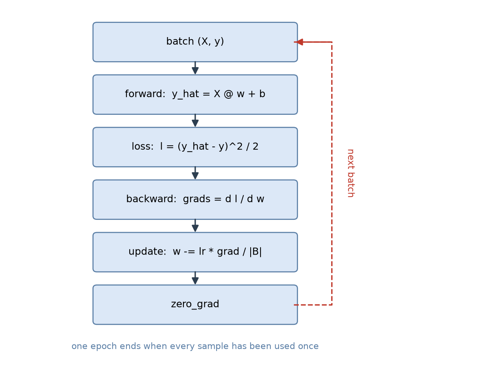

# B06 线性回归

从这一章起开始建模型。前面 B02 到 B05 是零件：张量运算、形状规则、自动微分、概率。
现在把它们装起来，做出第一个能从数据里学出参数的模型。

## 与书对应

| 讲义小节 | 纸质书（第一版） | 电子版（第二版） |
|---|---|---|
| 1 模型：从假设到表达式 | 3.1 线性回归的基本要素（模型） | [3.1 线性回归](https://zh.d2l.ai/chapter_linear-networks/linear-regression.html) 的"线性回归的基本元素" |
| 2 损失函数：为什么是平方误差 | 3.1 的"损失函数" | 3.1 的"正态分布与平方损失" |
| 3 优化：小批量随机梯度下降 | 3.1 的"优化算法" | 3.1 的"解析解"与"小批量随机梯度下降" |
| 4 从零实现 | 3.2 线性回归的从零开始实现 | [3.2 线性回归的从零开始实现](https://zh.d2l.ai/chapter_linear-networks/linear-regression-scratch.html) |
| 5 简洁实现 | 3.3 线性回归的简洁实现 | [3.3 线性回归的简洁实现](https://zh.d2l.ai/chapter_linear-networks/linear-regression-concise.html) |
| 6 实现会踩的坑 | 两版都散在正文里，本节汇总 | 同上 |
| 自测题 | 无 | 无 |

两版都有代码，第一版是 MXNet 的 `nd` 与 `autograd`，第二版有 PyTorch tab。
第一版没有"解析解"一节，第二版有。

**这一章有四个解锁点。** 纸质书 3.2 节里，`data_iter`、`linreg`、`squared_loss`、`sgd`
四处都标了"本函数已保存在 d2lzh 包中方便以后使用"。按仓库的规则，**在这句话出现之前
要把它们自己写出来**——讲义第 4 节会把每个函数要做什么讲清楚，但不会给可以直接抄的实现。

电子版这一章用的是 `d2l.load_array`、`d2l.synthetic_data`、`d2l.Animator` 这些封装，
按同一条规则现在都不能用，讲义里用裸 torch 与 matplotlib 的等价写法代替。

## 0 这一单元解决什么问题

前面几章你写的代码不依赖数据：张量运算的输入输出都是你自己给的。
这一章第一次出现"学习"这件事——模型不知道真实规律，只能从一堆样本里把它猜出来。

要回答三个问题：

1. **模型长什么样**：用什么形式的函数去拟合数据
2. **怎么衡量好坏**：用一个数把"当前参数有多差"表示出来
3. **怎么把它变好**：按什么规则改参数

三个问题各有固定的答案，这一章的三个小节就是它们。

## 1 模型：从假设到表达式

先看一个具体场景。预测房价：特征有面积、房龄两项，标签是价格。

**假设**价格大致是特征的线性组合：

$$\hat{y} = x_1 w_1 + x_2 w_2 + b .$$

$x_1$、$x_2$ 是输入（特征），$w_1$、$w_2$ 是权重，$b$ 是偏置，$\hat{y}$ 是预测值。
换成向量写法：$\hat{\mathbf{x}} \in \mathbb{R}^2$、$\mathbf{w}\in\mathbb{R}^2$，$\hat{y}=\mathbf{w}^\top\mathbf{x}+b$。

整批样本一起算就是矩阵形式。$\mathbf{X}\in\mathbb{R}^{n\times d}$（$n$ 个样本、$d$ 个特征）：

$$\hat{\mathbf{y}} = \mathbf{X}\mathbf{w} + b .$$

**这里有件事要提前说清**：这个式子是**人先假设的**，不是从数据里推出来的。
假设"特征与标签成线性关系"，然后在所有直线里挑一条最好的。
B01 讲过的"模型族"在这里第一次落地——这一章的模型族就是所有直线，
$w$ 与 $b$ 的取值决定具体是哪一条。

**为什么叫线性**：指对参数线性（$w$ 和 $b$ 都是的一次项），不是指对输入线性。
输入里可以加 $x^2$、$x_1x_2$ 这些项，只要参数还是线性的，仍然叫线性回归。
这一点在 B08 会用到。

### 1.1 三个量要分清

训练过程里有三样东西容易混：

| 名字 | 是什么 | 谁决定 |
|---|---|---|
| 特征 $\mathbf{X}$、标签 $\mathbf{y}$ | 数据，给定的 | 数据集 |
| 参数 $\mathbf{w}$、$b$ | 模型里要被学出来的量 | 训练过程 |
| 超参数（批量大小、学习率、迭代轮数） | 控制训练怎么进行的量 | 你 |

前两样的区别在 B01 讲过（判据是梯度下降会不会改它）。第三样是这一章新出现的：
它们不参与求导，是你先定下来再观察效果的。

## 2 损失函数：为什么是平方误差

模型有了，怎么衡量一组参数好不好？需要一个数。

对单个样本，用预测值与真实值之差的平方：

$$\ell^{(i)}(w_1, w_2, b) = \frac{1}{2}\left(\hat{y}^{(i)} - y^{(i)}\right)^2 .$$

整个数据集上取平均：

$$\ell(\mathbf{w}, b) = \frac{1}{n}\sum_{i=1}^n \ell^{(i)}(\mathbf{w}, b)
= \frac{1}{2n}\sum_{i=1}^n \left(\mathbf{w}^\top\mathbf{x}^{(i)} + b - y^{(i)}\right)^2 .$$

训练的目标就是找一组让这个数最小的参数：

$$\mathbf{w}^*, b^* = \operatorname*{argmin}_{\mathbf{w}, b}\ \ell(\mathbf{w}, b) .$$

### 2.1 三个问题

**为什么乘 $\frac{1}{2}$**：纯粹为了求导方便。对平方求导会掉下来一个 2，乘 $\frac{1}{2}$ 正好约掉，
梯度式子干净。这不影响最优解在哪——常数因子不改变最小值的位置。

**为什么用平方而不是绝对值**：三个理由。

1. 平方处处可微，绝对值在 0 点不可导。B04 讲过目标函数要对参数可微，梯度才给得出方向。
2. 平方对大偏差的惩罚更重（偏差翻倍，损失变四倍）。这是"宁可错一点，不要错太多"的偏好。
3. 有概率解释：见下一小节。

**为什么取平均而不是求和**：求和的话损失与样本量成正比，学习率得跟着样本量调。
取平均之后，不同数据集上的损失可比，学习率也稳定。

### 2.2 平方误差从哪来：高斯噪声假设

这个理由在纸质书 3.1 里没有展开，第二版有完整推导，值得看一眼。

假设真实关系是线性的，但观测带噪声：

$$\mathbf{y} = \mathbf{X}\mathbf{w} + b + \boldsymbol{\epsilon},$$

其中噪声 $\boldsymbol{\epsilon}$ 服从均值为 0、标准差为 $\sigma$ 的正态分布。
在这个假设下，"给定 $\mathbf{X}$ 时观测到 $\mathbf{y}$ 的概率"是

$$P(\mathbf{y}\mid\mathbf{X}) = \prod_{i=1}^n \frac{1}{\sqrt{2\pi}\sigma}
\exp\left(-\frac{1}{2\sigma^2}\left(\hat{y}^{(i)} - y^{(i)}\right)^2\right) .$$

想让这组数据出现的可能性最大，就要最大化这个乘积。取对数（单调变换，不改变最大值在哪）：

$$-\log P(\mathbf{y}\mid\mathbf{X}) = \frac{n}{2}\log(2\pi\sigma^2)
+ \frac{1}{2\sigma^2}\sum_{i=1}^n \left(\hat{y}^{(i)} - y^{(i)}\right)^2 .$$

第一项与参数无关。所以**最大化似然等价于最小化平方误差之和**。

结论：用平方损失不只是习惯，它隐含了"噪声是高斯的"这个假设。噪声分布换成别的
（例如拉普拉斯分布），对应的损失就变成绝对值之和。

## 3 优化：小批量随机梯度下降

损失函数的解析最小值不好直接求（虽然线性回归有闭式解，见 3.1 节末尾），
通用做法是迭代：先随便取一组参数，再按某个方向一点点改。

**梯度给方向**。B04 讲过梯度指向函数值上升最快的方向，所以往反方向走：

$$\mathbf{w} \leftarrow \mathbf{w} - \eta \nabla_{\mathbf{w}} \ell(\mathbf{w}, b),$$

$\eta$ 是学习率，控制每步走多远。

### 3.1 为什么不用全部样本算梯度

整个数据集上的梯度叫**批量梯度**，算一次要把所有样本过一遍。样本量大时这一步很贵，
而且每一步的收益递减。

另一个极端是每次只用一个样本，梯度噪声极大，走的路线会剧烈震荡。

**小批量随机梯度下降**（mini-batch SGD）取中间：每次随机抽一小批 $\mathcal{B}$，
用这批的平均梯度当全量梯度的估计：

$$\mathbf{w} \leftarrow \mathbf{w} - \frac{\eta}{|\mathcal{B}|}
\sum_{i\in\mathcal{B}} \nabla_{\mathbf{w}} \ell^{(i)}(\mathbf{w}, b).$$

书上的写法是 $\boldsymbol{\theta} \leftarrow \boldsymbol{\theta} - \frac{\eta}{|\mathcal{B}|}
\sum_{i \in \mathcal{B}} \nabla_{\boldsymbol{\theta}} \ell^{(i)}(\boldsymbol{\theta})$，
把 $\mathbf{w}$ 和 $b$ 合起来用 $\boldsymbol{\theta}$ 表示。

**为什么行得通**：小批量的平均梯度是完整梯度的无偏估计，这一点在 B05 第 6 节证明过。
批量越大，估计的方差越小（按 $\sigma^2/|\mathcal{B}|$ 缩小）。

**为什么用 `random.shuffle`**：每轮把样本顺序打乱，让每个批量的组成都不同。
不打乱的话每轮看到的是同样的分组，梯度方向会周期性地重复，收敛变慢。

### 3.2 学习率

$\eta$ 是这一章最需要手调的超参数：

- 太小：每步挪一点点，很多轮之后还没到最优，训练慢
- 太大：一步跨过最优，损失可能震荡甚至越来越大（发散）
- 合适：损失曲线平滑下降并逐渐趋平

书上的例子取 0.03。B25 会讲学习率调度与更聪明的优化器，现在只需要知道它存在、能调、
调坏了会怎样。

## 4 从零实现

这一节把上面三件事写成代码。**四个函数都要你自己写**（下面会说明每个要做什么），
对照纸质书 3.2 节时你会看到书上的 `data_iter`、`linreg`、`squared_loss`、`sgd`
都标了"已保存在 d2lzh 包中"——那正是这一节的解锁点。

### 4.1 生成数据集

书上用一个**人造**数据集：真实规律已知，方便检查学出来的参数对不对。

| 项 | 取值 |
|---|---|
| 样本数 | 1000 |
| 特征数 | 2 |
| 真实权重 | $\mathbf{w} = [2, -3.4]^\top$ |
| 真实偏置 | $b = 4.2$ |
| 噪声 | 均值 0、标准差 0.01 的正态分布 |

生成方式是 $\mathbf{y} = \mathbf{X}\mathbf{w} + b + \boldsymbol{\epsilon}$，
$\mathbf{X}$ 的每个元素从标准正态分布抽。

**torch 里怎么造**：`torch.normal(mean, std, size=...)` 返回指定形状的张量，
`torch.zeros(size)` 给全零。

### 4.2 读数据：`data_iter`

训练时要反复"随机抽一批样本"。这个函数用生成器写（A1 第 5 节）：

- 接受批量大小、特征、标签
- 每轮把样本下标打乱
- 按批量大小切分下标，逐个 `yield` 出对应的特征和标签

书上用 `features.take(j)` 按索引取行；torch 里直接 `features[j]` 就行（j 是整数张量）。
**别用 `features[list]` 那样传 Python 列表**——那会走花式索引，语义和你想的不同。

最后一个批量可能不满（样本数不被批量大小整除时），书上的写法用 `min` 处理了这种情况。

### 4.3 初始化参数

权重初始化成均值 0、标准差 0.01 的正态随机数，偏置初始化成 0。

**形状要留意**：书上写的是 `shape=(num_inputs, 1)`，也就是 $\mathbf{w}$ 是列向量。
这样 `X @ w` 得到 $(n, 1)$，与 `y` 的形状对得上。torch 里也可以让 $\mathbf{w}$ 是
$(d,)$，那时 `X @ w` 得到 $(n,)$——两种都行，但**同一个脚本里要统一**，
否则损失函数里那个 `reshape` 会失效或者出错。

两个参数都要开 `requires_grad`（B04 第 3 节）。

### 4.4 定义模型

`linreg(X, w, b)` 返回 `X @ w + b`。一行。

### 4.5 定义损失函数

`squared_loss(y_hat, y)` 返回 $(\hat{y}-y)^2/2$。

书上在减法之前先 `y.reshape(y_hat.shape)`，原因见 4.3 的形状说明。
另外注意书上**没有**除以批量大小——那个除法放在 `sgd` 里做，因为梯度是批量和。

### 4.6 定义优化算法

`sgd(params, lr, batch_size)` 对每个参数做

$$p \leftarrow p - \frac{\eta}{|\mathcal{B}|}\, p.\text{grad} .$$

三处要注意：

1. **要在 `torch.no_grad()` 里更新**。参数是叶子张量，在开梯度的模式下原地改会报错
   （B04 第 5.9 节）。
2. **要除以批量大小**。`loss` 是小批量上的和，`backward()` 给出的梯度也是和，
   除以批量大小才是平均梯度。
3. **要清零梯度**。这是 torch 与 MXNet 最关键的一处差异，见 4.7。

### 4.7 训练循环：`zero_grad` 为什么必须写




```python
for epoch in range(num_epochs):
    for X, y in data_iter(batch_size, features, labels):
        l = loss(net(X, w, b), y)
        l.sum().backward()          # 非标量输出，先求和
        sgd([w, b], lr, batch_size)
    ...
```

这段与书上的差别有两处：

**第一处：`l.sum().backward()`**。书上写的是 `l.backward()`，因为 MXNet 对非标量输出
会隐式先求和。torch 要求显式给出，否则报
`grad can be implicitly created only for scalar outputs`（B04 第 5.3 节）。

**第二处：`sgd` 里要清零梯度**。MXNet 的 `attach_grad()` 默认每次反向**覆盖**梯度缓冲区，
torch 的 `.grad` 一律**累加**（B04 第 5.2 节）。所以照搬书上的 `sgd` 会漏掉清零，
结果是梯度一轮轮叠加、等效学习率越来越大——**不报错，只是训练不正常**。

清零位置有讲究：要放在**用完梯度之后**（更新参数时顺手清），不能放在 `backward()` 之后
把刚算出来的梯度抹掉。

### 4.8 看结果

训练完成后比较学到的参数与真实参数：

```python
print(true_w, w)
print(true_b, b)
```

3 轮之后它们应当很接近。书上用的是 `train_l.mean().asnumpy()` 打印损失，
torch 里是 `train_l.mean().item()`——`.item()` 把单元素张量取成 Python 数值（B02 第 7.1 节）。

## 5 简洁实现

上面那 60 行，框架里都有现成的。第二版 3.3 节把同一件事用 `nn` 与 `optim` 重写了一遍。

### 5.0 先看要导入什么

框架版的导入：

```python
import torch
import torch.nn as nn
from torch.optim import SGD
from torch.utils.data import DataLoader, TensorDataset
```

| 模块 | 里面有什么 | 这一章用到的 |
|---|---|---|
| `torch` | 张量与基础运算 | `torch.normal`、`torch.no_grad` |
| `torch.nn` | 层、损失函数、模型基类 | `nn.Linear`、`nn.MSELoss` |
| `torch.optim` | 优化器 | `SGD` |
| `torch.utils.data` | 数据集与分批工具 | `TensorDataset`、`DataLoader` |

习惯上 `torch.nn` 导入时起别名 `nn`，所以代码里写 `nn.Linear` 而不是 `torch.nn.Linear`。
后两个也可以写全路径（`torch.optim.SGD`、`torch.utils.data.DataLoader`），效果一样。

第 4 节自己写的那版只需要 `import torch`。


### 5.1 四个替换

| 自己写的 | 框架里的 | 说明 |
|---|---|---|
| `data_iter` | `DataLoader(dataset, batch_size, shuffle=True)` | 需要先把数据包成 `TensorDataset` |
| `linreg` | `nn.Linear(in_features, out_features)` | 内部持有 `weight` 与 `bias` 两个 `nn.Parameter` |
| `squared_loss` | `nn.MSELoss()` | 均方误差，注意它默认取平均（与书上的写法差一个 2） |
| `sgd` | `torch.optim.SGD(net.parameters(), lr=...)` | `optimizer.step()` 更新，`optimizer.zero_grad()` 清零 |

`nn.Linear(2, 1)` 的 `weight` 形状是 `(1, 2)`、`bias` 是 `(1,)`——
注意它把输出维度放在前面，与你手写时 `(2, 1)` 的约定相反。这是 `nn.Linear` 的约定，
不是错误。

### 5.1.1 怎么用 `nn` 声明一个模型

`nn.Linear(2, 1)` 是一个**层**（把 2 维输入映射到 1 维输出），不是完整模型。
把它变成能调用的模型有两种写法。

**写法一：`nn.Sequential`。** 按顺序把层串起来，调用时依次穿过：

```python
net = nn.Sequential(nn.Linear(2, 1))
```

层多的时候：

```python
net = nn.Sequential(nn.Linear(2, 8), nn.ReLU(), nn.Linear(8, 1))
```

规则是前一层的输出形状必须与后一层的输入形状对得上。`Sequential` 只负责按顺序调用。

**怎么写 `net(X)`**：`nn.Module` 定义了 `__call__`，它转去调 `forward`。
所以 `net(X)` 与 `net.forward(X)` 结果相同，但**要写 `net(X)`**——
`__call__` 里还挂着 hook 等机制，直接调 `forward` 会绕过去。

**写法二：继承 `nn.Module`。** 层的顺序拼接用 `Sequential` 就够；
需要写控制流（分支、循环）或让同一层被多次调用时，才自己定义。结构是这样：

```python
class 你的模型名(nn.Module):
    def __init__(self, 超参数):
        super().__init__()          # 必须第一句
        self.某个参数 = nn.Parameter(...)

    def forward(self, X):
        ...                          # 返回预测值
```

三个要点：

1. **`super().__init__()` 必须第一句调用。** `nn.Module` 的初始化里建立了参数登记机制，
   不调它，后面给 `self` 挂参数会报错。
2. **`forward` 定义前向怎么算**，输入输出都是张量。
3. **要训练的量必须包成 `nn.Parameter`。** 写成 `self.w = torch.zeros(2, 1)` 也能跑，
   但它不会出现在 `net.parameters()` 里，优化器看不到它，训练时它永远不动。

**参数在哪**：`net.parameters()` 是生成器，遍历模型里全部 `nn.Parameter`。
`torch.optim.SGD(net.parameters(), lr=...)` 就是靠它拿到要更新的量。
`nn.Linear(in_features, out_features)` 内部有两个参数：`weight` 形状
`(out_features, in_features)`、`bias` 形状 `(out_features,)`——
注意它把输出维放在前面，与你手写 `(d, 1)` 的约定相反。

### 5.1.2 怎么定义优化器

```python
optimizer = torch.optim.SGD(net.parameters(), lr=0.03)
```

两个参数：

- **第一个是要更新的张量集合。** 传 `net.parameters()`，它遍历模型里全部 `nn.Parameter`。
- **`lr` 是学习率。**

`SGD` 还接受 `momentum`（动量）、`weight_decay`（权重衰减）、`nesterov` 等选项，
这一章用不到，B25 会讲它们的区别。

**优化器在构造时就把参数的引用存下来了**，后面调 `step()` 不必再告诉它更新谁。
反过来说：构造之后才加到模型上的层，它的参数不会被这个优化器更新——
出现"某些层不收敛"时可以查这一点。

两个方法：

| 方法 | 做什么 |
|---|---|
| `optimizer.zero_grad()` | 把登记参数的 `.grad` 清零（或置空） |
| `optimizer.step()` | 按当前梯度更新这些参数 |

用法就是训练循环里那三行，顺序是 `zero_grad` → `backward` → `step`。

`torch.optim` 下还有 `Adam`、`RMSprop`、`Adagrad`，接口一样，区别在更新式。
这一章用 `SGD`，B25 会比较它们。

**一处易混**：`torch.optim.SGD` 与自己写的 `sgd` 做的是同一件事，
但框架版**不做**除以批量大小这一步——那件事在损失函数里（见下）。

### 5.1.3 除以批量大小这件事，两边位置不同

这是书上没点明的一处差异，值得单独记。

**MXNet/Gluon 放在优化器里。** 纸质书 3.3 的循环写的是 `trainer.step(batch_size)`——
批量大小是传给优化器的参数，由它在内部把梯度按 $1/|\mathcal{B}|$ 缩放。
书上那句解释是"按照小批量随机梯度下降的定义，我们在 `step` 函数中指明批量大小，
从而对批量中样本梯度求平均"。3.2 里手写的 `sgd` 则自己除以 `batch_size`。

**PyTorch 放在损失函数里。** `nn.MSELoss()` 默认 `reduction='mean'`，
损失已经是平均值，所以 `optimizer.step()` **不带**批量大小参数。

书上的练习问过这件事：如果把 `l = loss(net(X), y)` 改成 `l.mean()`，
`trainer.step` 的参数该怎么改？答案是改成 1——平均已经在损失函数里做过了，不能再除一次。

自己写的那版（第 4 节）走的是第一条路：损失不取平均，`sgd` 里除以批量大小。
两条路的结果一样，但要清楚自己在哪条路上，别两边各除一次。

### 5.2 `TensorDataset`

`DataLoader` 需要知道"第 i 个样本是什么"。`TensorDataset(features, labels)` 把两个张量
按第一维对齐包成一个数据集，取第 i 项时返回 `(features[i], labels[i])`。

```python
dataset = TensorDataset(features, labels)
loader = DataLoader(dataset, batch_size=10, shuffle=True)
```

### 5.3 训练循环的样子

```python
for epoch in range(num_epochs):
    for X, y in loader:
        l = loss(net(X), y)
        optimizer.zero_grad()
        l.backward()
        optimizer.step()
```

顺序是 `zero_grad` → `backward` → `step`。这三行的顺序写错了不会报错，
只是训练结果不对，所以记住它。

### 5.4 两条实现要给出同样的结果

自己写的那版和框架版，在同样的数据、同样的超参数下应当收敛到接近的参数。
对不上说明其中一版写错了。这是检验"你确实理解了框架替你做了什么"的办法，
也是 PLAN.md 要求两条都做的原因。

## 6 实现会踩的坑

| 坑 | 症状 | 原因 |
|---|---|---|
| 忘了 `zero_grad` | 不报错，损失震荡或发散 | 梯度累加（4.7） |
| `l.backward()` 直接调 | `grad can be implicitly created only for scalar outputs` | 输出不是标量（4.7） |
| `sgd` 里忘了除批量大小 | 等效学习率放大 10 倍，损失炸掉 | 梯度是批量和（4.6） |
| 参数没开 `requires_grad` | `does not require grad` | 叶子张量要显式开（4.3） |
| `w` 与 `b` 形状约定不一致 | 损失函数里 `reshape` 静默失效或广播出错 | 4.3 的两种约定混用 |
| 更新参数没包 `no_grad` | `a leaf Variable that requires grad is being used in an in-place operation` | 4.6 |
| 学习率取 0.5 | 损失越来越大 | 步子跨过最优（3.2） |
| 用 `MSELoss` 却按书上的损失比较数值 | 差一个因子 2 | `MSELoss` 不乘 $\frac12$（5.1） |
| 内层循环变量与数据集同名 | 不报错，参数收敛到一半停住 | 变量遮蔽：`for X, y in data_iter(...)` 跑完一轮后数据集被最后一个批量覆盖（A1 第 8 节） |

## 命令速查

这一章用到的接口，按第一次出现的位置列。

| 命令 | 作用 | 讲义哪一节 |
|---|---|---|
| `torch.normal(mean, std, size=...)` | 按正态分布生成张量 | 4.1 |
| `torch.zeros(size)` | 全零张量 | 4.3 |
| `torch.arange(n)` | 生成下标序列 | 4.2 |
| `torch.randperm(n)` | 随机排列 0 到 n-1 | 4.2 |
| `Tensor.requires_grad_(True)` | 打开求导记录 | 4.3 |
| `X[idx]` | 按整数张量取行 | 4.2 |
| `l.sum().backward()` | 非标量输出先求和再反传 | 4.7 |
| `torch.no_grad()` | 这一段不建图 | 4.6 |
| `Tensor.grad.zero_()` | 就地清零某个参数的梯度 | 4.7 |
| `Tensor.item()` | 单元素张量取成 Python 数值 | 4.8 |
| `nn.Linear(in_features, out_features)` | 线性层 | 5.1 |
| `nn.MSELoss()` | 均方误差损失 | 5.1 |
| `torch.optim.SGD(params, lr=...)` | 随机梯度下降优化器 | 5.1 |
| `optimizer.zero_grad()` | 清零优化器里全部参数的梯度 | 5.3 |
| `optimizer.step()` | 按当前梯度更新参数 | 5.3 |
| `TensorDataset(a, b)` | 把两个张量按第一维对齐包成数据集 | 5.2 |
| `DataLoader(dataset, batch_size, shuffle)` | 分批迭代 | 5.2 |

## 自测题

1. 写出线性回归的向量形式，并说明 $\mathbf{X}$、$\mathbf{w}$、$\mathbf{y}$ 各自的形状。
2. 平方损失里的 $\frac12$ 为什么可以随便乘？它对最优解有影响吗？
3. 从高斯噪声假设出发，说明为什么最小化平方误差等价于最大化似然。
4. 小批量梯度为什么能代替全量梯度？批量大小怎么影响它的噪声？
5. 书上例子里学习率是 0.03。如果取 0.5 会看到什么现象？取 1e-6 呢？
6. `data_iter` 里为什么要 `shuffle`？不打乱会怎样？
7. 训练循环里 `zero_grad` 该放在哪一步？放错了会出什么问题？
8. 自己写的 `sgd` 与 `torch.optim.SGD` 相比，少做了哪些事？

## 答案（做完再看）

**1.** $\hat{\mathbf{y}} = \mathbf{X}\mathbf{w} + b$。$\mathbf{X}$ 是 $(n, d)$，
$\mathbf{w}$ 是 $(d, 1)$ 或 $(d,)$，$\mathbf{y}$ 是 $(n, 1)$ 或 $(n,)$。
两种约定都能跑通，但要在同一个脚本里统一。

**2.** 常数因子不改变最小值的位置。乘 $\frac12$ 只是让求导时掉下来的那个 2 被约掉，
梯度式子更干净。对最优解没有影响，对梯度的大小有影响——所以它与学习率的取值是耦合的。

**3.** 噪声高斯时，似然的对数是"常数减平方误差之和除以 $2\sigma^2$"。
最大化它对参数而言等价于最小化平方误差之和。噪声换成拉普拉斯分布，对应的就是绝对值损失。

**4.** 因为样本是独立同分布的，小批量的平均梯度是完整梯度的无偏估计（B05 第 6 节）。
噪声的方差按 $\sigma^2/|\mathcal{B}|$ 缩小，所以批量越大梯度越接近真值，但每步的计算也越贵。

**5.** 0.5 太大，每步跨过最优，损失会震荡甚至越来越大；1e-6 太小，
3 轮之后参数几乎没动，损失还停在初始附近。两个极端都不报错，只能从损失曲线上看出来。

**6.** 不打乱的话每轮的分组固定，梯度方向会周期性地重复，收敛变慢；
更糟的是如果数据本身有序（例如按类别排好），每个批量只覆盖一部分分布，训练会偏。

**7.** `zero_grad` 清的是**上一轮**留下的梯度，所以要放在这一轮 `backward()` 之前。
放在 `backward()` 之后会把刚算出来的梯度抹掉，那一轮等于白更新。

两种写法都对：一是 `optimizer.zero_grad()` 放在 `backward()` 前；
二是在手写的 `sgd` 里用梯度更新完顺手清（`p.grad.zero_()`）。关键是每一轮
`backward()` 累加之前，`.grad` 必须是干净的。

**8.** `torch.optim.SGD` 自己收集参数、更新与清零，还支持动量、权重衰减这些选项；
自己写的 `sgd` 只做了"减去学习率乘梯度除以批量大小"这一件事，
清零要显式写。除此之外框架版还处理了 `no_grad` 的包裹与参数分组。
