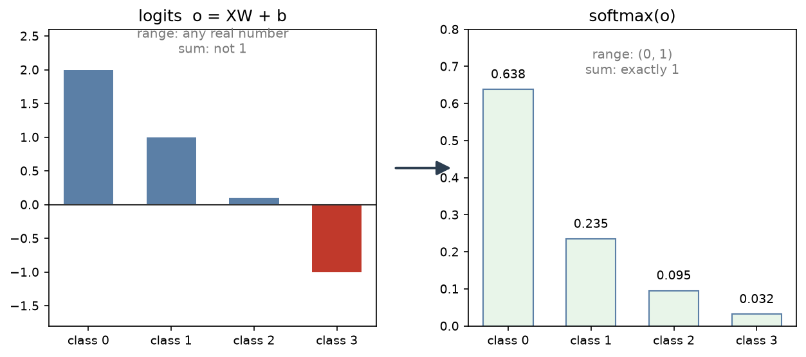

# B07 softmax 回归

B06 解决的是"预测一个数"，这一章解决"预测是哪一类"。改动看起来只是换个损失函数，
实际上牵扯到三处：输出怎么变成概率、损失怎么定义、结果怎么评估。

## 与书对应

| 讲义小节 | 纸质书（第一版） | 电子版（第二版） |
|---|---|---|
| 1 从回归到分类 | 3.4 分类问题 | [3.4 softmax 回归](https://zh.d2l.ai/chapter_linear-networks/softmax-regression.html) 的分类问题 |
| 2 模型：从线性输出到概率分布 | 3.4 softmax 回归模型、softmax 运算、单样本与小批量的矢量表达式 | 3.4 的"softmax 运算"、"矢量化" |
| 3 损失：交叉熵 | 3.4 交叉熵损失函数 | 3.4 的"损失函数"、"信息论基础"（后者是补充） |
| 4 数据集：Fashion-MNIST | 3.5 图像分类数据集 | [3.5 图像分类数据集](https://zh.d2l.ai/chapter_linear-networks/image-classification-dataset.html) |
| 5 从零实现 | 3.6 softmax 回归的从零开始实现 | [3.6 从零开始实现](https://zh.d2l.ai/chapter_linear-networks/softmax-regression-scratch.html) |
| 6 简洁实现 | 3.7 softmax 回归的简洁实现 | [3.7 简洁实现](https://zh.d2l.ai/chapter_linear-networks/softmax-regression-concise.html) |
| 7 评估：精度 | 3.4 的"模型预测及评价"、3.6 的"计算分类准确率" | 3.4 的"模型预测和评估"、3.6 的"分类精度" |
| 7.1 混淆矩阵 | 无，本节补充 | 无，本节补充 |
| 8 实现会踩的坑 | 散在两版正文里，本节汇总 | 同上 |
| 自测题 | 无 | 无 |

两版都有代码。第一版用 MXNet 的 `gloss.SoftmaxCrossEntropyLoss`，
第二版用 `nn.CrossEntropyLoss`，两者都**内含 softmax**——这一点在 6.2 节展开。

**解锁点**：纸质书这一章有四个函数标着"本函数已保存在 d2lzh 包中方便以后使用"：

| 函数 | 在哪一节 | 做什么 |
|---|---|---|
| `get_fashion_mnist_labels` | 3.5 | 把 0 到 9 的标签转成文本名 |
| `show_fashion_mnist` | 3.5 | 一行里画出多张图与对应标签 |
| `evaluate_accuracy` | 3.6 | 模型在整个数据集上的准确率 |
| `train_ch3` | 3.6 | 完整的训练过程（同时支持从零与简洁两条路） |

按仓库规则，在书上出现那句话之前要自己写。第 5 节会说明每个函数要做什么，
但不给可以直接抄的实现；后两个是这一章代码题的核心。
`train_ch3` 的参数表里有 `params`、`lr`、`trainer` 三组，正是为了让同一份训练代码
既能跑手写版也能跑框架版——这一点在 6.1 节的对照里会再出现。

电子版这一章用 `d2l.load_data_fashion_mnist` 与 `d2l.train_ch3` 这些封装，
按同一条规则现在不能用，讲义里给裸 torch 与 torchvision 的等价写法。

## 0 这一单元解决什么问题

B06 的模型输出一个实数，损失衡量它与真实值的距离。这一章的输出是**类别**：
给一张 28×28 的衣服图片，判断它是十类里的哪一类。

输出从"一个数"变成"十个类别之一"，三件事跟着变：

1. **模型最后要输出什么**。十个类别的分数怎么变成"属于每一类的概率"
2. **损失怎么定义**。"预测概率分布"与"真实类别"之间的距离用什么衡量
3. **怎么算对错**。回归看损失数值，分类看预测对了几成

## 1 从回归到分类

分类问题的形式：输入特征 $\mathbf{x}$，输出是 $q$ 个类别中的一个。

**为什么不能直接用线性回归做分类**：把类别编号当作数值去回归，会引入一个不存在的顺序。
把"猫=1、狗=2、鸟=3"拿去回归，模型会认为鸟和狗的差距是狗和猫的两倍，
而类别之间没有这种关系。类别编号只是名字。

**标签怎么表示**：用**独热编码**（one-hot）。$q$ 个类别对应 $q$ 维向量，
真实类别那一位置 1，其余为 0。真实类别是 3（从 0 数起）时，
标签写成 $\mathbf{y} = [0,0,0,1,0,\dots]^\top$。

这样标签也成了一个"分布"（只有一个位置概率为 1），与模型的预测分布可以直接比较。

**Fashion-MNIST 的 $q$ 是 10**，所以标签是 10 维独热向量。

## 2 模型：从线性输出到概率分布

### 2.1 为什么不能直接用线性输出

先照 B06 的样子算一个线性输出：

$$\mathbf{o} = \mathbf{X}\mathbf{w} + b .$$

$\mathbf{o}$ 有 $q$ 个数，可以理解为"模型给每一类打的分数"（**logits**）。

问题是这些分数不能当概率用：

- 可以是负数，而概率必须非负
- 加起来不等于 1，而 B05 讲过概率分布要满足规范性 $\sum_j P_j = 1$
- 同一个样本的分数可以任意缩放，无法解释成"可能性"

### 2.2 softmax 运算




把 logits 变成概率分布，用 **softmax**：

$$\hat{y}_j = \frac{\exp(o_j)}{\sum_{k=1}^q \exp(o_k)},\qquad j=1,\dots,q .$$

逐个看这个式子做了什么：

- **先指数**：$\exp$ 把任意实数映射到正数，解决了"不能为负"
- **再除以总和**：分母是所有指数之和，除完之后全部加起来正好是 1

两个性质：

1. **每个输出在 $(0,1)$ 内**，全部加起来等于 1，是一个合法的概率分布
2. **保序**：$\exp$ 是单调递增的，所以 $o_i > o_j$ 时必有 $\hat y_i > \hat y_j$。
   分数大的类别概率也大，softmax 不改变类别的相对顺序

写成向量形式（$\mathbf{o}$ 是一行 $q$ 个数）：

$$\hat{\mathbf{y}} = \operatorname{softmax}(\mathbf{o}) .$$

小批量下 $\mathbf{O} = \mathbf{X}\mathbf{W} + \mathbf{b}$ 的形状是 $(n, q)$，
softmax 按**行**做（每一行是一个样本的 $q$ 个类别分数），输出同样形状。
"按行"这件事在 torch 里要写成 `softmax(dim=1)`，见 5.2 节。

### 2.3 argmax 不变性

预测类别取分数最大的那个：

$$\operatorname*{argmax}_i o_i = \operatorname*{argmax}_i \hat y_i .$$

因为 softmax 保序，取 logits 的最大值下标与取概率的最大值下标结果相同。
这条性质有用：**推理时不必算 softmax**，直接对 logits 取 `argmax` 就行
（省一次指数运算，也不会有下溢风险）。

### 2.4 损失为什么不能用平方损失

最直接的想法是像 B06 那样比较两个分布：$\|\hat{\mathbf{y}} - \mathbf{y}\|^2/2$。
纸质书 3.4 节解释了为什么不用它。

分类任务**只要求正确类别的概率最大**，不要求概率完全等于标签。
真实类别是 3 时，只要 $\hat y_3$ 比别的都大，分类就对了。看两组预测：

| 预测 | $\hat y_3$ | 其他 | 分类 | 平方损失 |
|---|---|---|---|---|
| 甲 | 0.6 | 0.2, 0.2 | 对 | 大 |
| 乙 | 0.4 | 0, 0.6 | 错 | 小 |

甲的损失比乙大，但甲分类正确、乙错误。平方损失把"概率不够自信"看得比"分类错误"更重，
与任务目标不一致。

**结论**：需要换一个"只关心正确类别概率"的损失函数。

## 3 损失：交叉熵

### 3.1 定义

$$\ell(\mathbf{y}, \hat{\mathbf{y}}) = -\sum_{j=1}^q y_j \log \hat y_j .$$

$\mathbf{y}$ 是独热标签。代入之后只有一项非零（$y_{y^{(i)}} = 1$），所以：

$$\ell = -\log \hat y_{y^{(i)}} .$$

**只关心正确类别的预测概率**。正确类别的概率越高，$-\log$ 越小。

整个数据集的损失取平均：

$$\ell(\boldsymbol{\Theta}) = \frac{1}{n}\sum_{i=1}^n -\log \hat y^{(i)}_{y^{(i)}} .$$

### 3.2 为什么是"对数"

从"正确类别的概率应当尽量大"出发，直接最大化 $\hat y_{y^{(i)}}$ 也行，为什么要取对数？

1. **数值范围**。概率在 $(0,1)$ 之间，多个样本连乘会迅速下溢到 0。取对数后连乘变连加。
2. **梯度形状**。$-\log p$ 在 $p\to 0$ 时趋于无穷，等于说"非常自信地答错"惩罚极重；
   在 $p\to 1$ 时趋近 0。这个形状与直觉一致。
3. **与极大似然一致**。见下一小节。

### 3.3 与极大似然的关系

B05 讲过这批数据的似然（样本独立时联合概率连乘）：

$$P(\mathbf{Y}\mid\mathbf{X}) = \prod_{i=1}^n \hat y^{(i)}_{y^{(i)}} .$$

取负对数：

$$-\log P(\mathbf{Y}\mid\mathbf{X}) = -\sum_{i=1}^n \log \hat y^{(i)}_{y^{(i)}} = n\,\ell(\boldsymbol{\Theta}) .$$

所以**最小化交叉熵等价于最大化训练数据的似然**。纸质书 3.4 节用另一种写法说了同一件事：
最小化 $\ell$ 等价于最大化 $\exp(-n\ell) = \prod_i \hat y^{(i)}_{y^{(i)}}$。

这与 B06 的结构一样：平方损失对应高斯噪声假设，交叉熵对应"标签服从 categorical 分布"。
损失函数的选择背后是概率假设。

### 3.4 交叉熵对 logits 的梯度

这一条在实现里很关键。设 $\mathbf{o}$ 是某一行的 logits，
损失 $l = -\log \hat y_{y}$（$y$ 是正确类别），求 $\partial l/\partial o_j$：

$$\frac{\partial l}{\partial o_j} = \hat y_j - y_j .$$

也就是**预测概率减去真实标签**，一行代码。这个简洁的结果是 softmax 与交叉熵配合的结果——
两者分开看都麻烦，合起来导数就退化成减法。

**这也是框架把两者打包的原因**：`nn.CrossEntropyLoss` 接收 logits、内部做
`log_softmax`，而不是让你先 softmax 再传概率（那样会丢精度，见 5.2 与 6.2）。

## 4 数据集：Fashion-MNIST

**是什么**：10 类服饰的灰度图像，28×28 像素。训练集 60000 张、测试集 10000 张。
类别是 T 恤、裤子、套头衫、连衣裙、外套、凉鞋、衬衫、运动鞋、包、短靴。

**为什么用它**：MNIST（手写数字）太简单，1998 年就能做到 99% 以上，
区分度不够。Fashion-MNIST 的形状与规模相同，但难一些，2017 年发布。

**怎么读**（`torchvision` 提供）：

```python
from torchvision import datasets, transforms

train = datasets.FashionMNIST(root="data", train=True, download=True,
                              transform=transforms.ToTensor())
```

几个参数：

- `root`：数据放哪个目录。首次运行会下载（约 30 MB），之后直接用缓存
- `train`：True 取训练集，False 取测试集
- `transform`：对每张图做什么处理。`ToTensor()` 把 PIL 图像转成张量，
  形状从 $(28,28)$ 变成 $(1,28,28)$，并把像素值从 0–255 缩到 0–1
- `download=True`：本地没有就下载

取一个样本：`img, label = train[0]`，`img` 形状 $(1,28,28)$、`label` 是 0 到 9 的整数。

**为什么要拉平成向量**：这一章的模型是线性层，输入必须是一维特征。
$(1,28,28)$ 拉平是 784 维。`x.reshape(x.shape[0], -1)` 把一批图像
从 $(n,1,28,28)$ 变成 $(n,784)$，其中 `-1` 让 torch 自己算这一维多大（B02 第 2.4 节）。

**测试集不能用来训练**。它是唯一能反映泛化能力的部分，碰它就等于作弊。
这一章只用它做最终评估（B09 会正式讲这件事）。

## 5 从零实现

### 5.0 需要导入什么

```python
import torch
import torch.nn as nn
from torch.utils.data import DataLoader
from torchvision import datasets, transforms
```

第 4 节已经说明了每个模块的用处。自己写的那版（本节）不需要 `nn` 与 `optim`，
简洁实现（第 6 节）才用。

### 5.1 参数与数据

模型参数是 $\mathbf{W}$ 形状 $(784, 10)$ 与 $\mathbf{b}$ 形状 $(10,)$。
初始化方式与 B06 一样：权重取小的高斯随机数，偏置取 0。

**为什么是 10**：$q=10$ 个类别，每个类别一组权重。$(784,10)$ 的每一列
对应一个类别的打分函数。

### 5.2 softmax 与交叉熵：数值稳定性

把 2.2 与 3.1 的公式直接翻译成代码会有一个问题。实测一下：

```python
o = torch.tensor([[1000.0, 0.0]])
torch.exp(o) / torch.exp(o).sum()     # tensor([[nan, 0.]])
torch.softmax(o, dim=1)               # tensor([[1., 0.]])
```

`exp(1000)` 上溢成 `inf`，`inf / inf` 得到 `nan`。logits 的数值可以很大
（训练初期或初始化不当时就会），所以这个写法不能用在训练循环里。

**解决办法**：利用 softmax 的一个性质。分子分母同乘 $\exp(-m)$：

$$\hat y_j = \frac{\exp(o_j - m)}{\sum_k \exp(o_k - m)} .$$

结果完全不变（这是恒等变形），但指数里的数被平移了。取 $m = \max_k o_k$ 时，
最大的那一项变成 $\exp(0)=1$，其余的都在 $(0,1]$ 内，不会上溢。

**实践上直接调 `torch.softmax(x, dim=1)`**，它内部就是这么做的，不用自己写。

**再看交叉熵**。$\log(\hat y)$ 在 $\hat y$ 接近 0 时会变成 $-\infty$。
所以框架提供 `torch.log_softmax(x, dim=1)`，它把 log 与 softmax 合并计算，
精度比"先 softmax 再取 log"更好。

自己写损失时，如果图省事写成 `-torch.log(softmax(o, 1))`，数值上会差一点；
用 `log_softmax` 更稳。这一章的参考实现两种都验过，结果一致，但训练规模大时差别会显现。

**`dim` 为什么是 1**：`dim=0` 是批量那一维，`dim=1` 才是类别那一维。
写错成 `dim=0` 不报错，只是每一列单独归一化，结果全错。这是这一章最容易犯的错。

### 5.3 精度

损失数值不直观，看预测对了几成更清楚：

```python
def accuracy(y_hat, y):
    """y_hat 是 logits，形状 (n, q)；y 是标签，形状 (n,)。返回命中率。"""
```

做法是：对每一行取 `argmax` 得到预测类别，与真实标签逐元素比较，再求平均。
两个要点：

- 用 logits 取 argmax 即可（2.3 节的 argmax 不变性），不必先 softmax
- `y_hat.argmax(dim=1)` 返回的是整数张量，与 `y` 比较会得到布尔张量，
  转成浮点再 `.mean()` 才得到比例

### 5.4 训练循环

与 B06 的结构完全相同（图见 B06 讲义 4.7 节）：

```
取一批 → 前向 → 算损失 → 反传 → 更新 → 清零
```

三处与 B06 不同：

1. **前向**：`X` 要先拉平成 $(n, 784)$
2. **损失**：用交叉熵，而且**传 logits 不传概率**（见 6.2）
3. **每轮多看一个数**：训练集与测试集上的精度（5.3 的函数）

超参数：批量大小 256、学习率 0.1、迭代 5 轮。这两个数与 B06 不同，
原因是任务与数据规模变了——学习率与批量大小要跟着调，见 8 节。

### 5.5 评估要用 `no_grad`

算精度与测试损失时不需要梯度，包在 `torch.no_grad()` 里：
省内存、也省时间（不建图）。B04 第 5.5 节讲过这个上下文管理器的用途。

**别忘了在评估前切到评估模式**：这一章的模型没有 dropout 与 BN，
所以 `.eval()` 此刻不影响结果；等 B08 之后就必须写了。养成习惯从这时开始。

## 6 简洁实现

### 6.0 需要导入什么

```python
import torch
import torch.nn as nn
from torch.utils.data import DataLoader
from torchvision import datasets, transforms
```

与第 5 节一样，只是这回 `nn` 要用上。

### 6.1 与 B06 的对照

| B06 里手写的 | 这一章手写的 | 框架里的 |
|---|---|---|
| `data_iter` | 同样要自己写，或直接用 `DataLoader` | `DataLoader(dataset, batch_size, shuffle=True)` |
| `linreg` | `net(X) = softmax(X @ W + b)` | `nn.Linear(784, 10)` |
| `squared_loss` | 交叉熵 | `nn.CrossEntropyLoss()` |
| `sgd` | 一样 | `torch.optim.SGD(net.parameters(), lr=...)` |

结构没变，换的是层与损失。这也说明 B06 学到的那套训练框架是通用的。

### 6.2 `nn.CrossEntropyLoss` 内含 softmax

**这是这一章最容易搞错的地方**：`nn.CrossEntropyLoss` 接收的是 **logits**，
它内部做了 `log_softmax` 加负对数似然。所以**不要再传 softmax 的输出**。

实测（torch 2.14.0）：

```python
logits = torch.tensor([[2.0, 1.0, 0.1]])
t = torch.tensor([0])
nn.CrossEntropyLoss()(logits, t)                              # 0.41703
nn.NLLLoss()(nn.LogSoftmax(dim=1)(logits), t)                 # 0.41703
-torch.log(torch.softmax(logits, 1))[0, 0]                    # 0.41703
```

三者数值相同，说明 `CrossEntropyLoss` 等价于"log_softmax 之后算负对数似然"。
若在调用前又做了一次 softmax，等于算了两次，梯度会变小、训练变慢，而且不报错。

**在从零实现里也一样**：`net(X)` 返回 logits，损失函数内部自己处理，
不要把 softmax 塞进模型。B06 的 `linreg` 返回预测值、损失单独算，结构照搬。

### 6.3 标签的形状

`nn.CrossEntropyLoss` 要的标签形状是 $(n,)$ 的**整数**张量，
不是 $(n,10)$ 的独热向量。

这与第 3 节的公式看起来不同（那里用的是独热 $\mathbf{y}$）。原因是实现上做了等价简化：
既然只有一项非零，就没必要传出整个独热向量，直接传正确类别的下标即可。
损失值完全一样。

`torchvision` 的 `FashionMNIST` 返回的标签就是整数，可以直接用。
如果手里有独热标签，要用 `argmax(dim=1)` 转成下标。

**标签类型要留意的两处**（实测 torch 2.14.0）：

- float32 且形状 $(n,)$：直接报 `expected target dtype to be Long or Byte, but got Float`
- float32 且形状 $(n,q)$：**不报错**，被当成"软标签"（每个样本一个概率分布）走另一条计算路径。
  手滑把独热标签转成浮点传进去就会落到这里，数值对不上却查不出原因

## 7 评估：精度

**精度**（accuracy）是最常用的分类指标：预测正确的比例。

**两版书里这个函数的签名与返回值都不一样**，读的时候留意：

| | 纸质书（v1） | 电子版（v2） |
|---|---|---|
| 定义 | `accuracy(y_hat, y)` | `accuracy(y_hat, y)` |
| 返回 | **比例**（正确数除以总数） | **正确个数** |
| 在整个数据集上评估 | `evaluate_accuracy(data_iter, net)` | `evaluate_accuracy(net, data_iter)` |

后一行是参数顺序相反，照抄会报错或者算出莫名结果。本讲义统一用 v1 的顺序
（数据在前、模型在后），返回值用比例。

### 7.1 混淆矩阵

**这一节是补充，两版书里都没有。** 全仓库里"混淆矩阵"只出现在第二版讲分布偏移的那一章。

**它解决什么**：精度只给一个数，看不出错在哪。


**它不够用**的情况：类别不平衡时。设想 99% 的样本是 A 类，
一个"永远预测 A"的模型精度是 99%，但毫无用处。所以看精度要同时看各类别的分布。

**混淆矩阵**（confusion matrix）是 $q\times q$ 的表，
第 $i$ 行第 $j$ 列是"真实类别 $i$、预测成 $j$"的样本数。对角线是预测正确的，
对角线之外能看到**错在哪**：例如 5（凉鞋）与 7（运动鞋）互相混淆得多，
说明模型没抓住这两类的区别。

这一章的题目会要求算混淆矩阵，`torch.zeros((10,10))` 加索引累加即可。

## 8 实现会踩的坑

| 坑 | 症状 | 原因 |
|---|---|---|
| 损失前又做了一次 softmax | 不报错，损失降得慢 | `CrossEntropyLoss` 内含 softmax（6.2） |
| `softmax(dim=0)` | 不报错，精度约 10% | 归一化方向错了，应该按类别维（5.2） |
| 朴素 `exp/sum` 写法 | 出现 `nan` | 指数上溢（5.2） |
| 传独热标签给 `CrossEntropyLoss` | 形状报错或结果异常 | 它要 $(n,)$ 的整数标签（6.3） |
| 忘了把图像拉平 | 矩阵乘法形状报错 | 线性层要 $(n,784)$，图像是 $(n,1,28,28)$（4 节） |
| 评估时没包 `no_grad` | 结果对，但慢且吃内存 | 白建了一张计算图（5.5） |
| 用测试集调超参数 | 测试精度虚高 | 测试集只能用来看最终结果（4 节） |
| 学习率沿用 B06 的 0.03 | 收敛慢 | 批量从 10 变成 256，学习率要跟着调（5.4） |
| 电子版里 `y_hat` 一会儿是概率一会儿是 logits | 损失不降 | v2 的 3.6 让 `net` 返回概率、3.7 让 `net` 返回 logits，同名不同义，读代码要看它传给谁 |
| 标签是 float32 | `RuntimeError: expected target dtype to be Long or Byte` | 整数标签要 int64；形状为 $(n,q)$ 的浮点标签会被当成软标签，静默走另一条路径（6.3） |

## 命令速查

这一章用到的接口，按第一次出现的位置列。

| 命令 | 作用 | 讲义哪一节 |
|---|---|---|
| `datasets.FashionMNIST(root, train, download, transform)` | 读 Fashion-MNIST | 4 |
| `transforms.ToTensor()` | PIL 图像转张量，像素缩到 0–1 | 4 |
| `Tensor.reshape(n, -1)` | 拉平图像 | 4 |
| `torch.softmax(x, dim=1)` | 按类别维做 softmax（内部做平移防上溢） | 5.2 |
| `torch.log_softmax(x, dim=1)` | softmax 后取 log，精度更好 | 5.2 |
| `Tensor.argmax(dim=1)` | 取每行最大值的下标 | 5.3 |
| `Tensor.float()` | 布尔张量转浮点，便于求平均 | 5.3 |
| `Tensor.mean()` | 求平均 | 5.3 |
| `torch.no_grad()` | 这一段不建图 | 5.5 |
| `nn.Linear(784, 10)` | 线性层 | 6.1 |
| `nn.CrossEntropyLoss()` | 交叉熵损失，**接收 logits** | 6.2 |
| `torch.zeros((10, 10))` | 混淆矩阵的容器 | 7 |

## 自测题

1. 为什么不能把类别编号直接当回归目标？
2. softmax 的两个性质是什么？为什么它不改变类别的相对顺序？
3. 分类任务为什么不用平方损失？举一组预测说明它的判断与任务目标相反。
4. 交叉熵公式里只有一项非零，为什么？
5. 最小化交叉熵与最大化似然是什么关系？
6. 交叉熵对 logits 的导数是什么？这个结果为什么让"softmax 与交叉熵打包"变得必要？
7. `torch.exp(o) / torch.exp(o).sum()` 在什么情况下出问题？正确写法做了什么变形？
8. `nn.CrossEntropyLoss` 接收 logits 还是概率？如果传了 softmax 的输出会怎样？
9. `softmax(dim=1)` 写成 `softmax(dim=0)` 会看到什么现象？
10. 精度这个指标在什么情况下会误导？

## 答案（做完再看）

**1.** 类别编号没有顺序关系。把它当数值回归，等于假设"鸟与狗的距离是狗与猫的两倍"。
独热编码去掉了这个虚假的顺序。

**2.** 每个输出在 $(0,1)$ 内且总和为 1；保序（$\exp$ 单调递增）。
保序保证了 `argmax` 在 logits 上与在概率上结果相同，所以推理时不必算 softmax。

**3.** 分类只要求正确类别的概率最大。真实类别为 3 时，
预测 $(0.6, 0.2, 0.2)$ 分类正确但平方损失大，预测 $(0.4, 0, 0.6)$ 分类错误但平方损失小。
平方损失惩罚"不够自信"多过惩罚"分类错误"。

**4.** $\mathbf{y}$ 是独热向量，只有一个位置是 1，其余位置乘以 $\log\hat y_j$ 后都是 0，
所以求和只剩 $-\log \hat y_{y}$。

**5.** 等价。负对数似然等于 $n$ 乘平均交叉熵，常数因子不影响最小值的位置。
B06 里平方损失对应高斯噪声，这里交叉熵对应标签的 categorical 分布。

**6.** $\partial l/\partial o_j = \hat y_j - y_j$，预测概率减真实标签。
分开看，softmax 的雅可比矩阵很麻烦，交叉熵的导数也不简单；合起来只剩一个减法。
所以框架把两者打包成 `CrossEntropyLoss`，避免用户自己拼。

**7.** logits 数值大时 `exp` 上溢成 `inf`，`inf/inf` 得到 `nan`（实测 logits 为 1000 时）。
正确写法是分子分母同乘 $\exp(-m)$，取 $m=\max_k o_k$，最大的项变成 $\exp(0)=1$，
其余在 $(0,1]$ 内不会上溢。`torch.softmax` 内部就是这么做的。

**8.** 接收 logits。传 softmax 的输出等于做了两次 softmax，
梯度会变小、收敛变慢，而且不报错。要传概率时该用 `nn.NLLLoss` 配 `log_softmax`。

**9.** 不报错，但归一化方向错了：变成每一列（跨样本）单独归一化，
每个类别的概率不再构成分布。精度会停在随机水平附近（10 类约 10%）。

**10.** 类别不平衡时。99% 的样本属于 A 类时，"永远预测 A"的模型精度 99% 却没有用。
这时要看混淆矩阵与各类别上的表现。
